# Project Work II

- Topic: **Web Development with Streamlit and Python**
- Student: **Tim Riffelmacher**
- Supervisor: **Prof. Dr.-Ing. Holger Vogelsang**
- Begin: **25.09.2023**

## Table of contents

1. [Idea](#idea)
2. [Streamlit](#streamlit)
3. [Further Technology](#further-technology)
4. [Project Structure](#project-structure)
5. [Installation](#installation)
6. [Manual](#manual)
7. [Evaluation](#evaluation)  
   7.1 [Advantages](#advantages)  
   7.2 [Disadvantages](#disadvantages)
8. [Summary](#summary)

## Idea

The primary objective is to create a web application designed to assist users in effectively managing their finances. This is achieved through the implementation of three core functionalities. Firstly, an integrated stock tool provides users with the ability to track and stay updated on the latest trends in the stock market. Secondly, a personal wallet feature is implemented to facilitate the tracking of expenditures and income. Lastly, a chat network is developed to enable users to engage in discussions with others. These three core functionalities empower users to manage their finances with clarity and efficiency.

## Streamlit

The implementation of the web application is done using [Streamlit](https://streamlit.io/), a Python package renowned for its rapid and straightforward web application development capabilities. According to developers, Streamlit excels in visually preparing and presenting data through reports or dashboards. Throughout the project's implementation, an assessment will be conducted to test Streamlit's suitability for implementing the specified project idea. A comprehensive [Evaluation](#evaluation) will be documented at a later stage.

## Further Technology

Two notable technologies, in addition to Streamlit, are employed in the web application. Firstly, [Supabase](https://supabase.com/) serves as a Backend-as-a-Service, allowing the application to persist data in a relational database. It enhances data security through [Row-Level-Security](https://supabase.com/docs/guides/auth/row-level-security) and provides an authentication mechanism adaptable to various web applications. Secondly, the [Yahoo Finance](https://finance.yahoo.com/) API is utilized to retrieve information and stock prices about companies. This is facilitated by the Python package [yfinance](https://pypi.org/project/yfinance/), a convenient wrapper for the Yahoo Finance API.

## Project Structure

In the following the top-level folders and files present in this repository are explained:

- **.streamlit/** - Environment variables for Streamlit
- **components/** - Stores reusable components (e.g. input fields)
- **pages/** - Defines the pages to be displayed
- **resources/** - Holds resources (e.g. images) regarding the documentation
- **utils/** - Stores reusable functionality (e.g. db-connection)
- **.gitignore** - Configures Git
- **Dashboard.py** - The entry point of the web application
- **README.md** - Holds the documentation
- **requirements.txt** - Stores the Python dependencies to be installed

## Installation

Firstly, ensure that [Python3](https://www.python.org/downloads/) is installed on your system. Afterwards, proceed to install the required dependencies by executing the command `pip3 install -r requirements.txt` in the root directory of the repository. Once the dependencies are installed, initiate the web application by executing `streamlit run Dashboard.py` (A browser window should open automatically, otherwise the serving details are posted in the console). If the streamlit command is not recognized, you may need to add it to the `$PATH`, or consider creating a [virtual Python environment](https://docs.python.org/3/library/venv.html).

## Manual

This chapter explains the functionalities offered by the web application and provides guidance on how to correctly utilize them.

### Navigation Bar

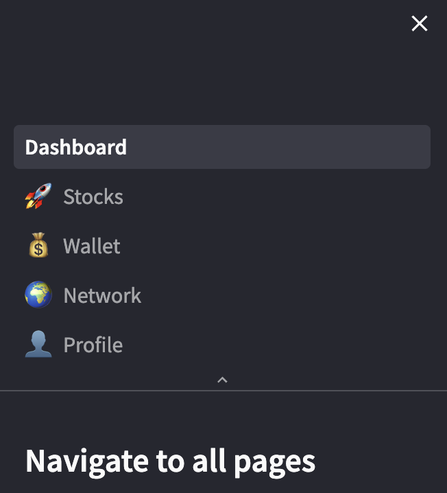

On the left side of the web application, a navigation bar is presented, facilitating navigation among the five distinct pages, each of which is elaborated upon in the following.

### Dashboard Page

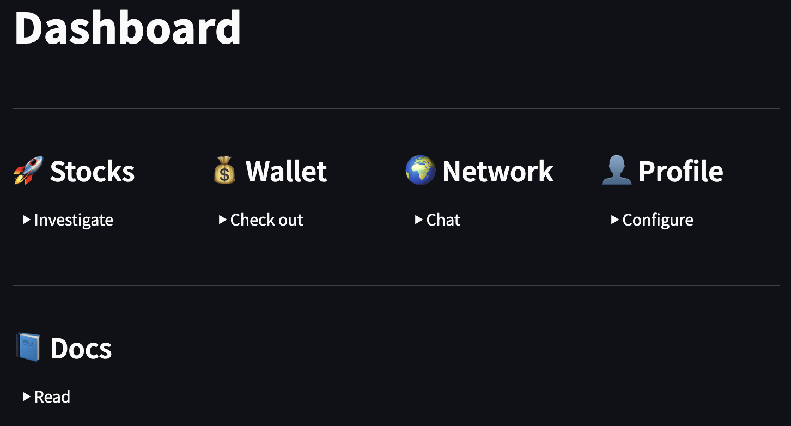

This serves as the entry point for the web application. Similar to the navigation bar, it offers access to the remaining four pages. Additionally, it includes a link to the documentation for further reference.

### Stocks Page

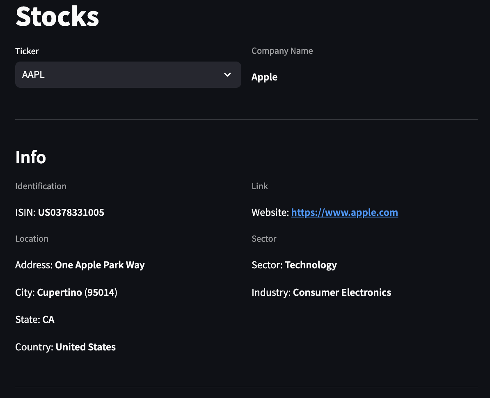

On this page, users can explore stock prices and the latest news for various companies. At the top of the page, users can select the specific company they wish to investigate. Below this, a section with general information, including details such as the location of the company, is displayed. Further down the page, users will find the _Market_ section.

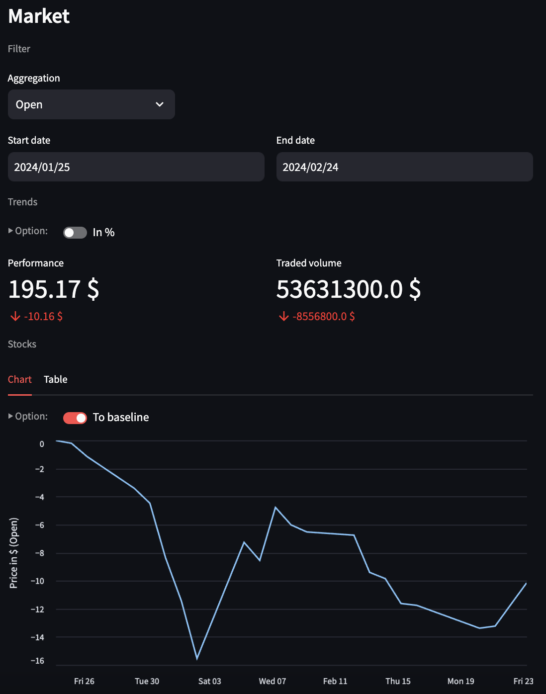

In this section, users can observe stock prices. Begin by selecting the type of aggregation, which dictates the data points to be displayed in the chart:

- **Open:** The stock price at the beginning of one day.
- **High:** The highest stock price of one day.
- **Low:** The lowest stock price of one day.
- **Close:** The stock price at the end of the day.

Following that, set the desired time interval for analysis. You can now observe trends depicting the stock's performance and traded volume within the selected timeframe. Optionally, switch to percentage view by activating the _In %_ toggle. At the bottom, the line chart illustrates the fluctuations in stock price over time. Additionally, there is an option to shift the graph to zero by activating the _To baseline_ toggle. For users preferring an Excel-like overview instead of a chart, they can switch to the _Table_ tab.

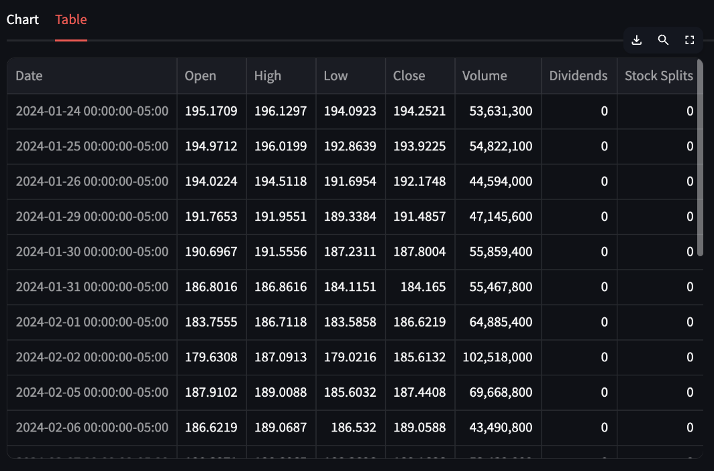

Here all important numbers within the selected time span are presented.

If you continue scrolling down, you will reach the _News_ section.

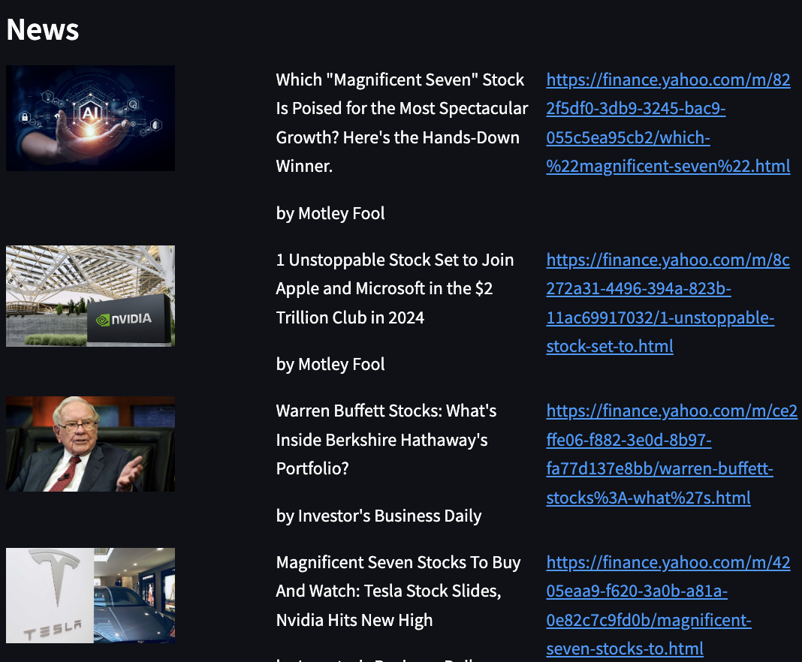

In this section, users are presented with a list of the latest news concerning the selected company. Links are also provided for those who wish to delve deeper into each article.

### Wallet Page

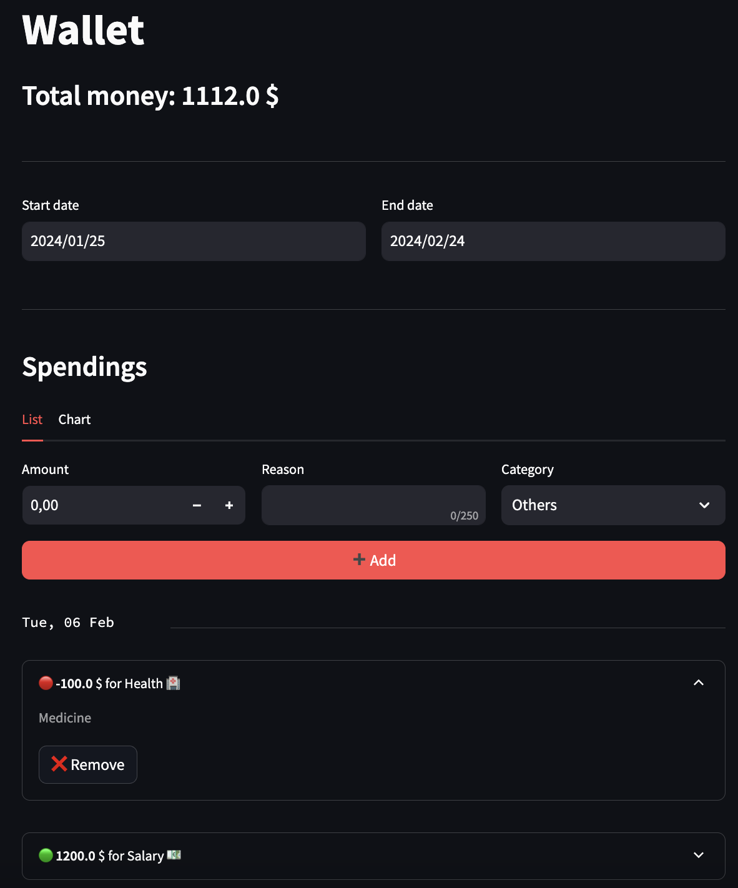

On this page, users can track their expenditures (and income). At the top of the page, set the desired time interval for observing financial activities. The bottom section displays a list of expenditures made within this specified timeframe. Clicking on a spending entry expands it, revealing additional details, including any provided reasons, and offering the option to delete it by clicking the _Remove_ button. To add a new spending, go to the top of the list, enter the amount, provide an optional reason, and select a category. Subsequently, click the _Add_ button to save the new entry. For a more detailed analysis of how your total finances have changed over time, navigate to the _Chart_ tab.

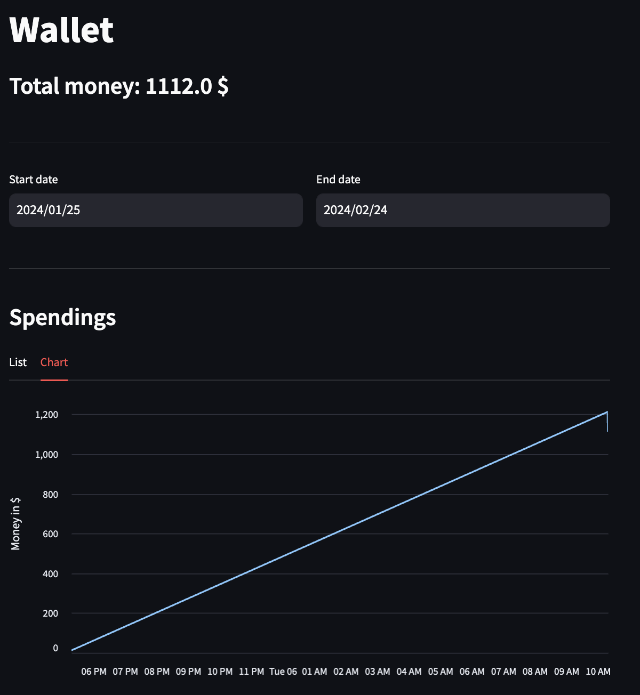

Here a line chart is presented, illustrating the development of your total financial assets over the selected time interval.

### Network Page

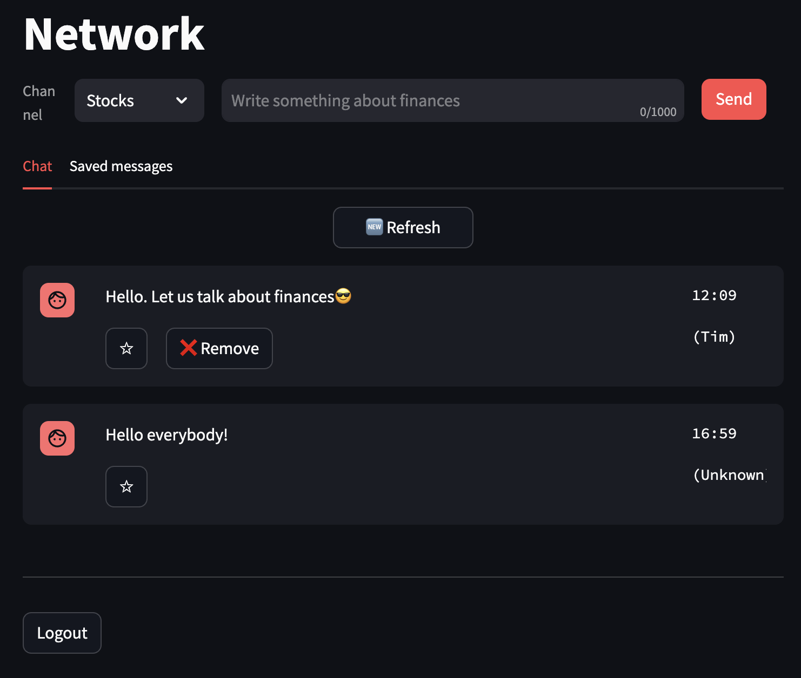

On the network page, users can engage in discussions with others on finance topics. To do so, they can select the appropriate channel, write their message, and send it. The chat window displays the six latest messages, and users have the option to delete their own messages by clicking the _Remove_ button, making it no longer visible to others. Clicking on the _Refresh_ button catches new messages from others and displays them (This is necessary due to lack of support of asynchronous operations and poor render preformance. More details on this are stated in the [Evaluation](#evaluation)). Additionally, messages can be saved by clicking the _Star_ button, preserving them in the user's _Saved messages_ tab for future reference.

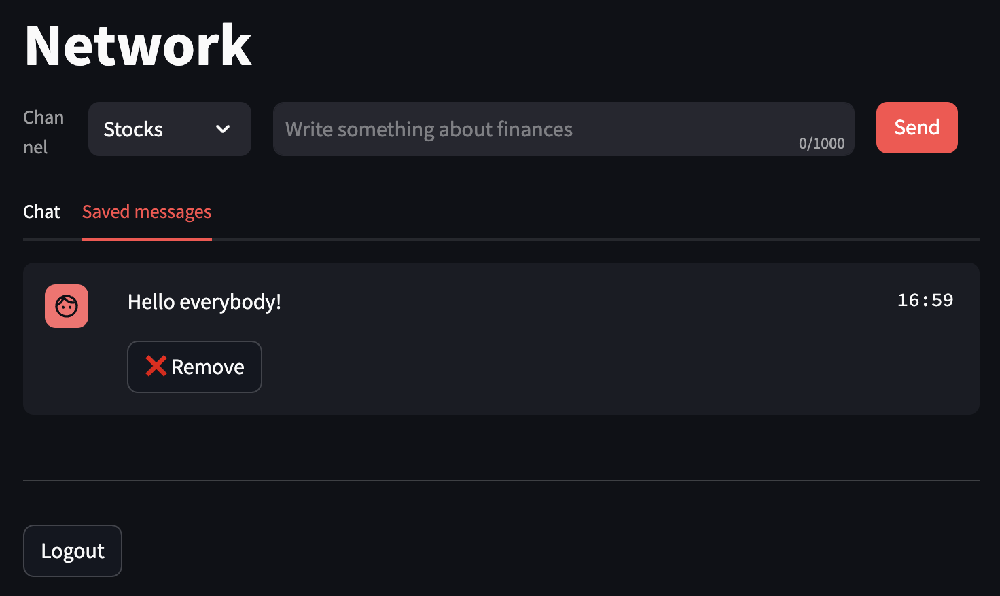

In this tab, users can view their saved messages. Moreover, they have the option to remove a message from their saved collection by clicking on the _Remove_ button.

### Profile Page

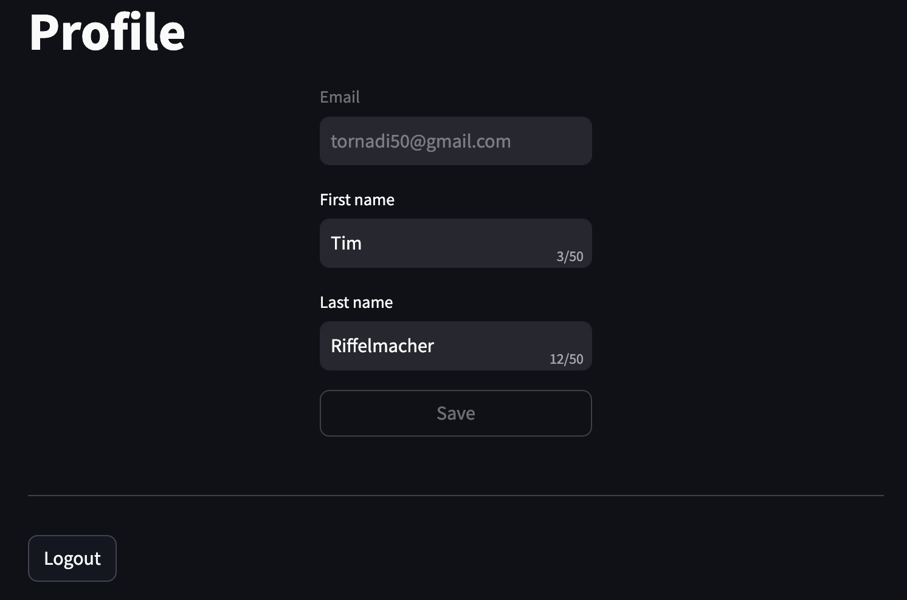

Here users can update their personal settings, including their first and last names. The first name is displayed when posting a message on the network page.

### Log In & Sign Up

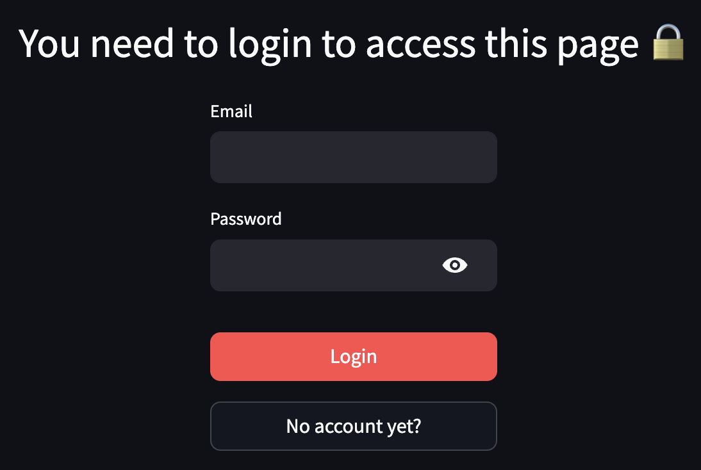

Access to certain pages, such as _Wallet_, _Network_, and _Profile_, requires user authentication. If not signed in, these pages will display a login form. To gain access, simply log in. If you don't have an account, click on the _No account yet?_ button to register.

## Evaluation

This section assesses both the advantages and disadvantages of employing Streamlit for the development of web applications. These statements are derived from the development of this specific project idea and may not necessarily be universally applicable to other projects or reflect potential advancements introduced in further updates of Streamlit.

### Advantages

#### Fast & Easy Development

One of the most significant advantages of using Streamlit lies in its minimal learning curve, allowing users to comprehend its functionality and develop web applications in a short period. The Streamlit Python library is remarkably straightforward, eliminating the need to understand every intricate concept. Proficiency in implementing components, such as buttons and inputs, along with understanding the control flow of Streamlit (data distribution and management), equips users to create web applications with essential functionality.

Moreover, Streamlit significantly accelerates the development process. Unlike traditional web application development, there is no requirement to dive into CSS for aesthetic enhancements; Streamlit takes care of design, ensuring a visually appealing interface. Additionally, diverse data types can effortlessly be presented using various chart types, requiring minimal effort on the part of the developer.

#### Data Presentation

As previously highlighted, Streamlit excels in presenting diverse data types through a wide array of chart options. Whether it's simple line charts, scatterplots, or complex graphs, Streamlit supports them all. The inclusion of third-party extensions further expands the available charting options, streamlining the development process and enabling developers to concentrate on data processing, rather than spending time on presentation details. Additionally, Streamlit facilitates easy experimentation with different chart types, allowing developers to explore various visualizations without significant time investment.

Example:

```python
    st.line_chart(total_money_course, y="Money in $")
```

Result:

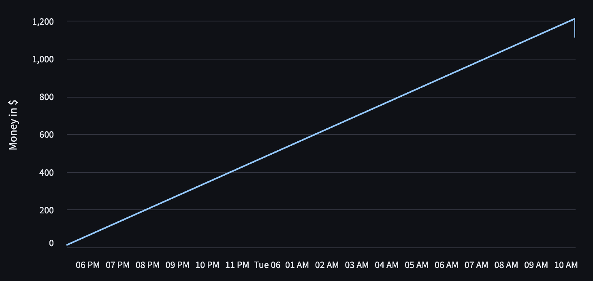

#### Good Documentation

The Streamlit [documentation](https://docs.streamlit.io/) stands out for its simplicity and clarity. Firstly, it provides a comprehensive introduction that facilitates a clear understanding of Streamlit's main concepts. Secondly, the API guide is well-structured and easily understandable, allowing users to quickly locate and access the information they need. Additionally, the documentation offers a convenient [cheatsheet](https://docs.streamlit.io/library/cheatsheet) that provides a overview of the most crucial API calls.

#### Uniform Design

As mentioned earlier, Streamlit simplifies the design process by eliminating the need to create a design system or concept, followed by the development of reusable and uniform components (e.g. buttons, input fields, etc.). Instead, Streamlit provides pre-styled components that are ready to use, sparing developers from the initial design groundwork. While all components come with default styles, the Streamlit library offers some customization options, allowing users to adjust the components to their specific use cases — whether it's changing button labels, adjusting input placeholders, or more.

In some instances, it might be beneficial to organize a composition of components in a reusable library. Particularly when dealing with repetitive elements like a start-to-end date input across multiple pages, reducing code duplication. Additionally, Streamlit's [theming](https://docs.streamlit.io/library/advanced-features/theming) capabilities allow for global adjustments, enabling users to specify primary and secondary colors, fonts, and other stylistic elements that apply to all Streamlit components.

### Disadvantages

#### Confusing Session State

In a general context, the rendered pages within Streamlit are inherently stateless. To preserve state information, the utilization of Streamlit's provided [session state](https://docs.streamlit.io/library/api-reference/session-state) becomes imperative. This operates as a key-value store with an indefinite growth capacity. Consequently, managing state complexity requires precise documentation to prevent it from spiraling out of control, necessitating clear records of the stored information within the session state.

#### Poor Styling Options

The Streamlit components offer only a restricted array of styling options. Primarily, the available choices are confined to two colors — namely, the primary and secondary color predetermined by the global theme. The absence of direct interaction with the underlying CSS of these components leaves developers with no option but to implement pure HTML code for extended customization. A further example for Streamlit's poor styling options: Achieving the horizontal centering of a component lacks a straightforward option. Instead, the developer must utilize a column layout approach, placing the component within the central column and adjusting its width to match that of the column.

In addition to that Streamlit produces very unresponsive web applications. Thus making one web application that fits for mobile devices and PC at the same time is hardly achievable.

#### Poor Render Performance

Relative to other frameworks facilitating web application development, Streamlit has suboptimal rendering performance. The time required to render a page is notably extended compared to frameworks such as [React](https://react.dev/). While this may be tolerable for static pages that necessitate a single loading and rendering instance, the drawback becomes apparent in scenarios requiring frequent page rerendering due to dynamic component changes. In such cases, the prolonged rendering duration may result in user frustration.

#### No Real Asynchrony

Unfortunately, Streamlit's support for executing actions in the background is very constrained. The underlying concept dictates that a page achieves the 'fully-loaded' status only upon the completion of all background operations. Consequently, the platform does not facilitate the loading of data in the background, followed by asynchronous injection into the page. Thus rendering times may be intolerably longer.

#### Duplicated Code

Given the functional programming paradigm employed in Streamlit's page development, the trend for code duplication in Streamlit is notable. The absence of object orientation fails to necessitate thoughtful consideration regarding the decomposition of pages into classes and relations. Thus testability and reusability suffer from this.

Consequently, it becomes imperative to establish a reusable component library early in the development process, one that can be universally used across all pages. Failure to do so may result in challenges during subsequent refactoring endeavors.

#### Missing Control Flow Options

Until a recent update, Streamlit introduced the capability for programmatically changing between pages, a feature previously unavailable. However, another barrier remains as rerendering a page using

```python
    st.rerun()
```

is currently not possible within callbacks. The absence of this option poses limitations, particularly in scenarios where a page reload is required, such as when a refresh button is pressed.

#### Input Field Confirmation

Typically, when entering information into an input field and promptly pressing an action button (e.g. save), there is a potential issue where the most recent data in the input field might not be accessible at the time of button click. This is caused by the behavior of the input field, which updates the data only upon pressing enter or unfocusing the input field. Consequently, this can lead to problematic race conditions. This problem cannot be solved easily at present.

## Summary

In summary, Streamlit serves as an entry-level framework, facilitating the entry of non-technical users into web application development without significant concern for technical details. It provides an extensive collection of reusable components and ensures a cohesive design, imparting a polished look-and-feel to the web application. Moreover, Streamlit excels in effortlessly visualizing large datasets through various chart options.

However, it comes with certain limitations. The framework lacks the flexibility found in other web application frameworks, as it is notably constrained to its predefined components with limited customization options. Additionally, Streamlit falls short in terms of tooling and performance compared to its counterparts. Consequently, Streamlit proves most suitable for scenarios where a static data-presenting web application with minimal interaction requirements is needed.
